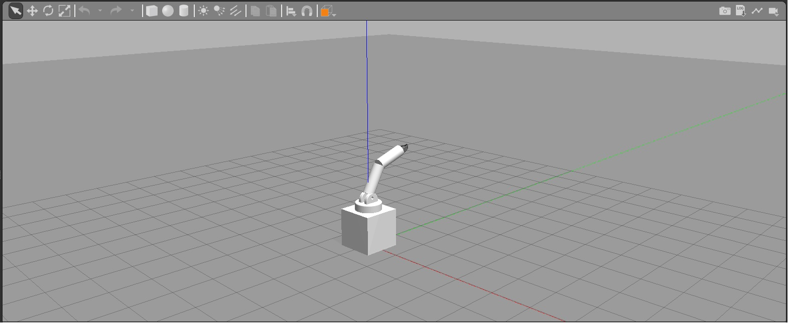

# Robotic Arm

This code is sample code for forward and backward kinematic of a robotic arm. The code was for robotics class. 
The arm was developed by [A-jay98](https://github.com/A-jay98/AJTemplateBot) as the TA of the class.

The code does both forward and backward kinematic.

You can find the details of forward and backward kinematics [here](https://cdn.intechopen.com/pdfs/379/InTech-Robot_kinematics_forward_and_inverse_kinematics.pdf)

The code is developed using ros services.

## Installation
I tested this code on Ubuntu 18.04 with Ros Melodic.

Steps for installation:
1) Initialize your catkin working environment
2) Clone this repository to and move the "src" folder to your workspace
3) Run ```catkin_make``` in the root folder of your workspace


## How to run
First open a new terminal in the root folder of your workspace 
1) Run ```source devel/setup.bash```
2) Run ```roslaunch AJTemplateBot final_launch.launch ```

Now open a new terminal in the root folder of your workspace to run the client side
1) Run ```source devel/setup.bash```
2) Run:
*  ```rosrun AJTemplateBot forward_client.py {theta1} {theta2} {theta2}``` for forward kinematic.
*  ```rosrun AJTemplateBot backward_client.py {x} {y} {z} ``` for backward kinematic.
 
 A picture of the robot in Gazebo workspace


